<h1>🏋️‍♂️ Performance Master - Landing Page com IA</h1>

Uma landing page completa e profissional para a academia Performance Master, desenvolvida com React, Vite e Styled Components, <strong>integrada com chatbot inteligente com n8n</strong>.

<h2>🤖 Novidade: Chatbot com Inteligência Artificial</h2>

Esta landing page inclui um <strong>sistema de chat conversacional</strong> integrado ao n8n, proporcionando atendimento automatizado e inteligente 24/7.

<h3>Imagens do Projeto</h3>

<h4>Desktop</h4>

  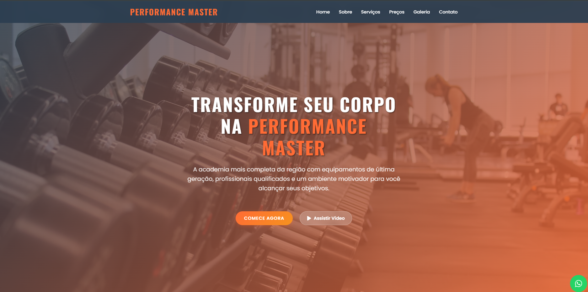
  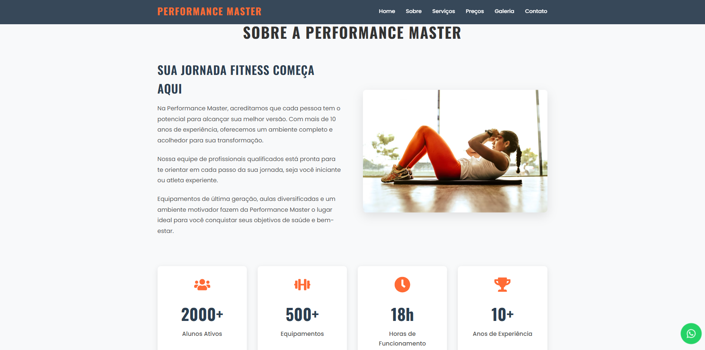
  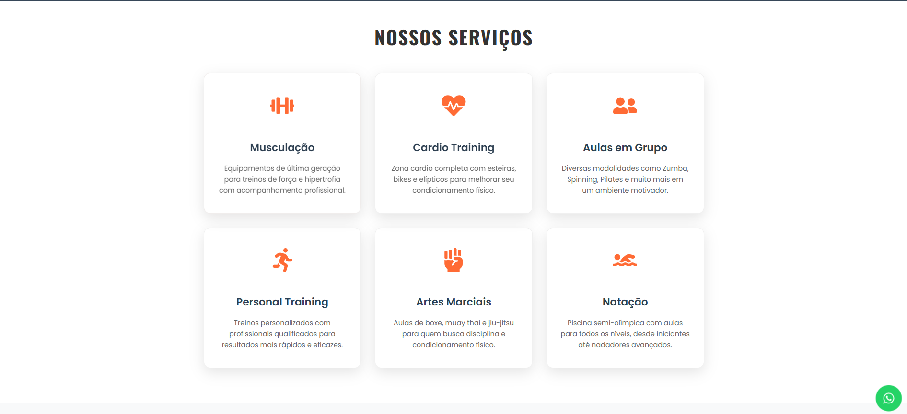
  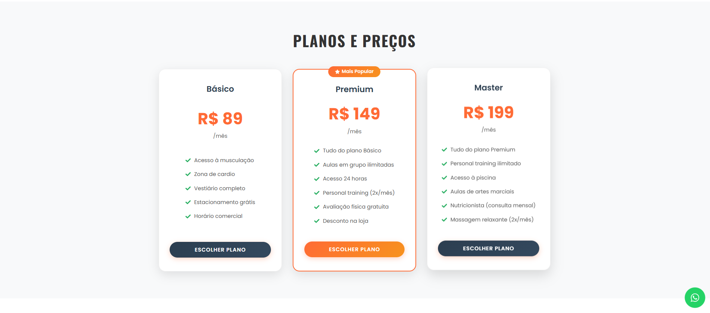
  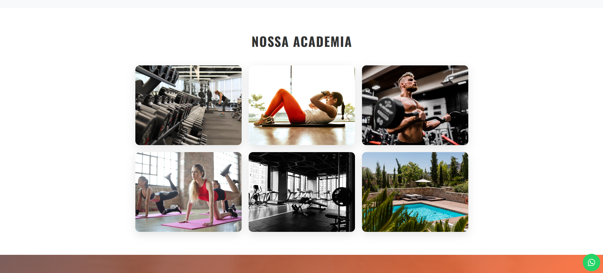
  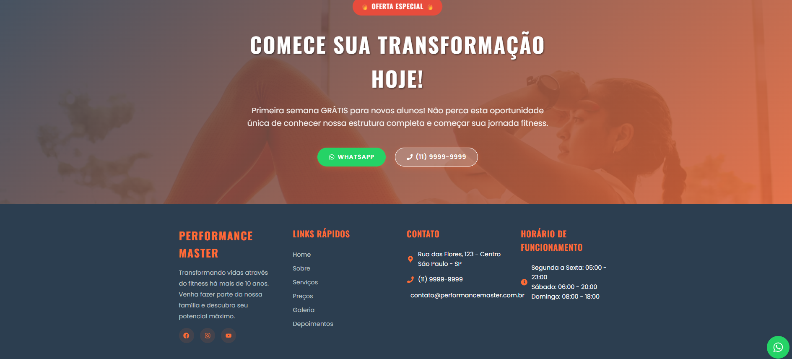

<h4>Mobile</h4>

  
  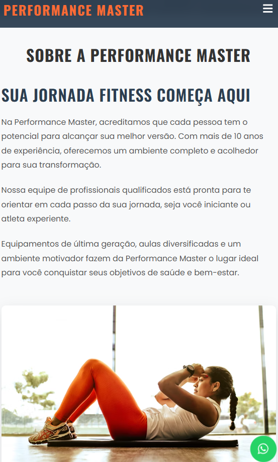
  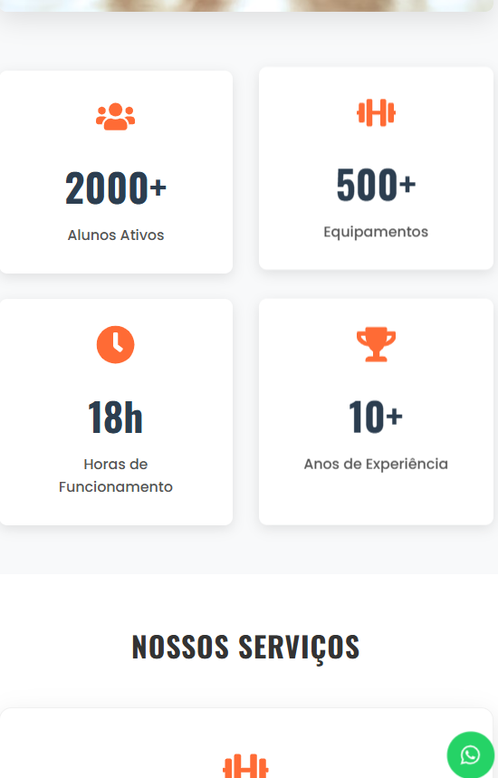
  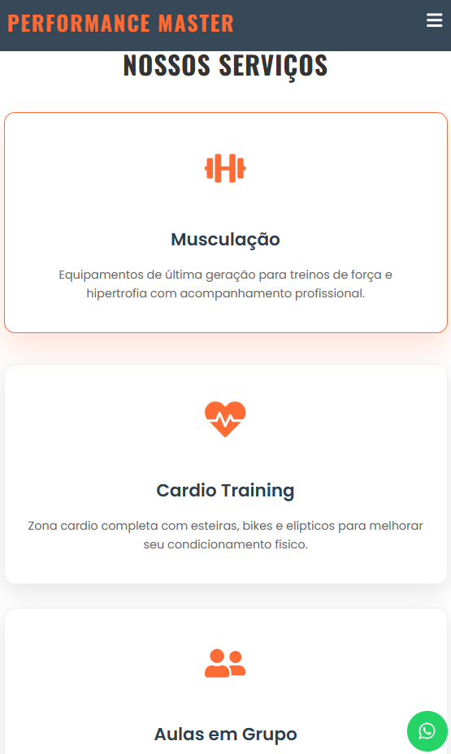
  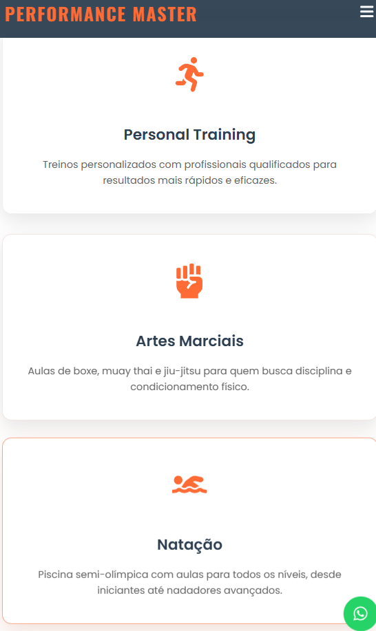
  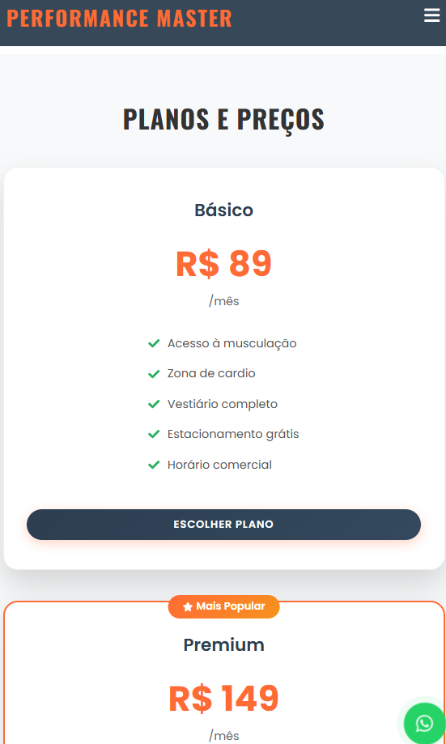
  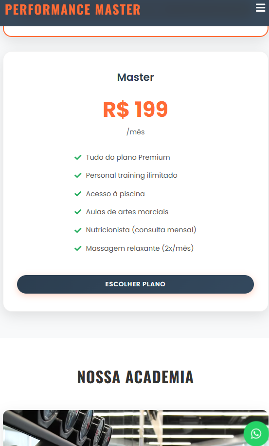
  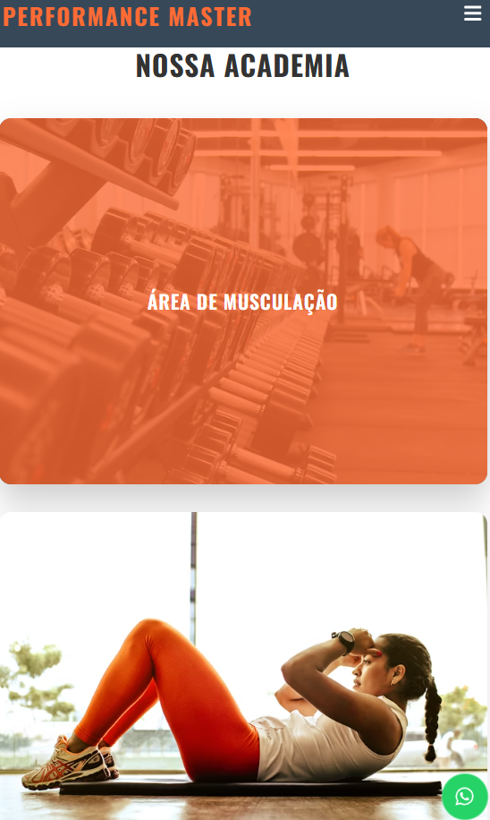
  

<h3>🧠 Funcionalidades do Chatbot IA:</h3>

<ul>
  <li><strong>💬 Chat Interativo</strong>: Interface moderna estilo WhatsApp</li>
  <li><strong>🔗 Integração n8n</strong>: Webhook para processamento de IA</li>
  <li><strong>⚡ Respostas Instantâneas</strong>: IA treinada sobre academia e fitness</li>
  <li><strong>📱 Multi-canal</strong>: Chat interno + redirecionamento WhatsApp</li>
  <li><strong>🎯 Contextual</strong>: Respostas personalizadas para planos, horários e serviços</li>
  <li><strong>📊 Analytics</strong>: Tracking de conversas via n8n</li>
</ul>

<h2>🏋️‍♂️ Sobre o Projeto</h2>

Landing page responsiva para academia com design moderno e profissional, incluindo:

<h3>📋 Seções Implementadas</h3>

<ol>
  <li><strong>Header</strong> - Navegação fixa com menu responsivo</li>
  <li><strong>Hero</strong> - Seção principal com call-to-action</li>
  <li><strong>About</strong> - Sobre a academia com estatísticas</li>
  <li><strong>Services</strong> - Serviços oferecidos (6 modalidades)</li>
  <li><strong>Pricing</strong> - Planos e preços (3 opções)</li>
  <li><strong>Gallery</strong> - Galeria de fotos da academia</li>
  <li><strong>Testimonials</strong> - Depoimentos de clientes</li>
  <li><strong>CTA</strong> - Call-to-action com oferta especial</li>
  <li><strong>Footer</strong> - Informações de contato e links</li>
  <li><strong>🤖 WhatsApp Float</strong> - Widget de chat com IA integrada</li>
</ol>

<h2>🚀 Tecnologias Utilizadas</h2>

<h3>Frontend</h3>
<ul>
  <li><strong>React 18</strong> - Biblioteca JavaScript para interfaces</li>
  <li><strong>Vite</strong> - Build tool moderna e rápida</li>
  <li><strong>Styled Components</strong> - CSS-in-JS para estilização</li>
  <li><strong>React Icons</strong> - Biblioteca de ícones</li>
</ul>

<h3>IA & Automação</h3>
<ul>
  <li><strong>n8n</strong> - Plataforma de automação para chatbot</li>
  <li><strong>Webhook Integration</strong> - Comunicação em tempo real</li>
  <li><strong>AI Processing</strong> - Processamento inteligente de mensagens</li>
</ul>

<h2>📱 Recursos</h2>

<h3>🎯 Funcionalidades Core</h3>
<ul>
  <li>✅ Totalmente responsiva</li>
  <li>✅ Design moderno e profissional</li>
  <li>✅ Animações suaves</li>
  <li>✅ Menu mobile hamburger</li>
  <li>✅ Scroll suave entre seções</li>
  <li>✅ Otimizada para SEO</li>
  <li>✅ Cores e identidade visual consistente</li>
</ul>

<h3>🤖 Funcionalidades IA/Chat</h3>
<ul>
  <li>✅ <strong>Chat Widget Flutuante</strong> - Sempre acessível</li>
  <li>✅ <strong>Interface Conversacional</strong> - UX intuitiva</li>
  <li>✅ <strong>Typing Indicators</strong> - Feedback visual em tempo real</li>
  <li>✅ <strong>Message History</strong> - Histórico da conversa</li>
  <li>✅ <strong>Multi-estado</strong> - Inicial, chat ativo, loading</li>
  <li>✅ <strong>Fallback WhatsApp</strong> - Integração com WhatsApp Web</li>
  <li>✅ <strong>Responsive Design</strong> - Mobile-first approach</li>
</ul>

<h2>🎨 Paleta de Cores</h2>

<ul>
  <li><strong>Primária</strong>: #ff6b35 (Laranja Performance)</li>
  <li><strong>Secundária</strong>: #f7931e (Amarelo Energy)</li>
  <li><strong>Escura</strong>: #2c3e50 (Professional Dark)</li>
  <li><strong>Clara</strong>: #f8f9fa (Clean Light)</li>
  <li><strong>Success</strong>: #25d366 (WhatsApp Green)</li>
</ul>

<h2>📦 Instalação e Uso</h2>

<pre><code># Clonar repositório
git clone &lt;repository-url&gt;
cd projeto-performace

# Instalar dependências
npm install

# Executar em modo desenvolvimento
npm run dev

# Build para produção
npm run build

# Preview da build
npm run preview
</code></pre>

<h2>🔧 Configuração do Chatbot n8n</h2>

<h3>1. Setup do Webhook</h3>

Configure um workflow no n8n com:

<ul>
  <li>Webhook</li>
  <li>Set (edit)</li>
  <li>ia com gpt</li>
  <li>code</li>
  <li>de saida webhook</li>
</ul>

<h3>2. Estrutura do Webhook Response</h3>

<pre><code>{
  "response": "{{ $json.response }}"
}
</code></pre>

<h3>3. URL Configuration</h3>

Configure a URL do webhook no arquivo <code>WhatsAppFloat.jsx</code>:

<pre><code>const N8N_WEBHOOK_URL = 'SEU LINK DO WEBHOOK';
</code></pre>

<h2>📁 Estrutura do Projeto</h2>

<pre><code>src/
├── components/
│   ├── Header/
│   │   ├── Header.jsx
│   │   └── Header.styles.js
│   ├── Hero/
│   │   ├── Hero.jsx
│   │   └── Hero.styles.js
│   ├── About/
│   │   ├── About.jsx
│   │   └── About.styles.js
│   ├── Services/
│   │   ├── Services.jsx
│   │   └── Services.styles.js
│   ├── Pricing/
│   │   ├── Pricing.jsx
│   │   └── Pricing.styles.js
│   ├── Gallery/
│   │   ├── Gallery.jsx
│   │   └── Gallery.styles.js
│   ├── Testimonials/
│   │   ├── Testimonials.jsx
│   │   └── Testimonials.styles.js
│   ├── CTA/
│   │   ├── CTA.jsx
│   │   └── CTA.styles.js
│   ├── Footer/
│   │   ├── Footer.jsx
│   │   └── Footer.styles.js
│   └── 🤖 WhatsAppFloat/
│       ├── WhatsAppFloat.jsx    # Chat IA Component
│       └── WhatsAppFloat.styles.js
├── assets/
│   └── project-apresentation/
├── styles/
│   ├── GlobalStyles.js
│   └── theme.js
└── App.jsx
</code></pre>

<h2>🎯 Funcionalidades Detalhadas</h2>

<h3>🏠 Landing Page Core</h3>
<ul>
  <li>Menu de navegação com scroll suave</li>
  <li>Seção hero com background parallax</li>
  <li>Cards interativos com hover effects</li>
  <li>Galeria de imagens responsiva</li>
  <li>Formulário de contato (CTA)</li>
  <li>Links para redes sociais</li>
  <li>Informações de contato e horários</li>
</ul>

<h3>🤖 Sistema de Chat IA</h3>
<ul>
  <li><strong>Chat Interface</strong>: Design moderno estilo WhatsApp</li>
  <li><strong>State Management</strong>: React hooks para gerenciar conversa</li>
  <li><strong>Message Types</strong>: Suporte a mensagens de usuário e bot</li>
  <li><strong>Typing Simulation</strong>: Indicador visual de "digitando..."</li>
  <li><strong>Session Persistence</strong>: Histórico da conversa mantido</li>
  <li><strong>Error Handling</strong>: Fallbacks para problemas de conexão</li>
  <li><strong>Multi-channel</strong>: Chat direto + WhatsApp integration</li>
</ul>

<h2>🔗 Integrações</h2>

<h3>WhatsApp Business</h3>
<ul>
  <li>Link direto para WhatsApp Web</li>
  <li>Mensagens pré-formatadas por contexto</li>
  <li>Números de telefone configuráveis</li>
</ul>

<h3>n8n Automation</h3>
<ul>
  <li>Webhook para receber mensagens</li>
  <li>Processamento de IA customizável</li>
  <li>Analytics e logging de conversas</li>
  <li>Integração com CRM (futuro)</li>
</ul>

<h2>📊 Analytics & Monitoring</h2>

O sistema de chat coleta métricas importantes:

<ul>
  <li><strong>Engagement</strong>: Taxa de interação com o chat</li>
  <li><strong>Conversion</strong>: Mensagens que geram leads</li>
</ul>

<h2>📧 Contato & Suporte</h2>

Para dúvidas sobre implementação ou personalização:

<ul>
  <li><strong>Chat IA</strong>: Use o próprio sistema de chat da página! 🤖</li>
  <li><strong>WhatsApp</strong>: +55 11 9999-9999</li>
  <li><strong>Email</strong>: contato@performancemaster.com</li>
</ul>

<h2>📄 Licença</h2>

Este projeto está sob licença MIT. Veja o arquivo <a href="LICENSE">LICENSE</a> para mais detalhes.

<strong>Desenvolvido por Carlos Resende para a Performance Master - ficcional</strong>

</body>
</html>
- **n8n** - Plataforma de automação para chatbot
- **Webhook Integration** - Comunicação em tempo real
- **AI Processing** - Processamento inteligente de mensagens

## 📱 Recursos

### 🎯 Funcionalidades Core
- ✅ Totalmente responsiva
- ✅ Design moderno e profissional
- ✅ Animações suaves
- ✅ Menu mobile hamburger
- ✅ Scroll suave entre seções
- ✅ Otimizada para SEO
- ✅ Cores e identidade visual consistente

### 🤖 Funcionalidades IA/Chat
- ✅ **Chat Widget Flutuante** - Sempre acessível
- ✅ **Interface Conversacional** - UX intuitiva
- ✅ **Typing Indicators** - Feedback visual em tempo real
- ✅ **Message History** - Histórico da conversa
- ✅ **Multi-estado** - Inicial, chat ativo, loading
- ✅ **Fallback WhatsApp** - Integração com WhatsApp Web

## 🎨 Paleta de Cores

- **Primária**: #ff6b35 (Laranja Performance)
- **Secundária**: #f7931e (Amarelo Energy)
- **Escura**: #2c3e50 (Professional Dark)
- **Clara**: #f8f9fa (Clean Light)
- **Success**: #25d366 (WhatsApp Green)

